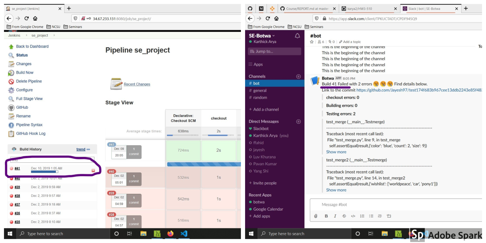
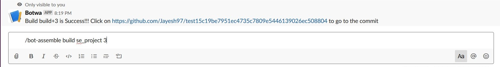
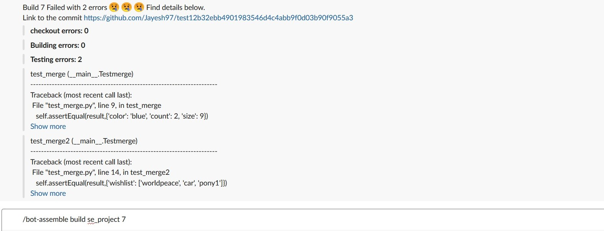
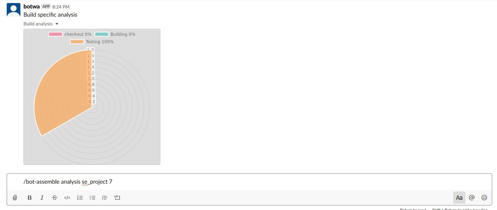
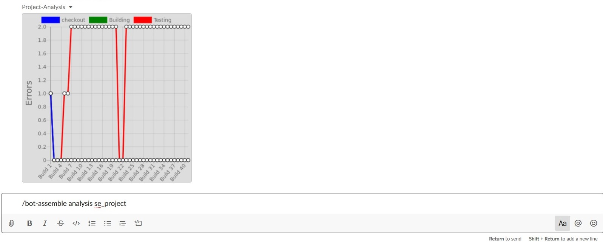

## The problem your bot solved

* Jenkins is a crucial part of CI and most of the software projects use Jenkins to build the project before deploying to the production. Often the build on Jenkins fails due to multiple reasons. For a standard developer it is very difficult to identify the reasons of failure for the following reasons:
    1. No access to the Jenkins logs
    2. The logs in Jenkins is an amalgamation of raw text dump from Jenkins. It contains various Jenkins information along with the errors which causes the failure. It is very difficult to visually identify the errors from this raw text dump.

* Our bot aims to solve this problem by parsing the Jenkins logs and filtering out the errors, stage wise, i.e Checkout, Building and Testing. Furthermore we also store this errors to perform error distribution of a build and over the time error occurance of the whole project. This analysis can help a team identify commom points of failures of in the project and fix them along with most frequent types of failures.

## Primary features and screenshots

* Feature 1: A Successful/Failed build on Jenkins triggers the bot to fetch the errors and post on slack channel

* Feature 2: A user can fetch errors of any historical build of any project from slack

##### Build successful

##### Build failure

* Feature 3: A user can visualize the error analysis of the whole project or of a particular build of a project

##### Build Analysis

##### Build Analysis

## Overall Reflection

The project was divided into different milestones to develop the project iteratively in accordance with the Software Engineering Guidelines.

The Design phase sets the foundation for the project and clarity in this phase is vital for the project implementation. For the design and architecture, we used Wireframes and Storyboard which helped us to visualize the overall flow of the use cases and helped us to showcase the core problems we are trying to solve in our project.
Testing practices helped us to test individual components as well as the integrated services of our project. As a testing practice we used Unit , Integration and Acceptance testing to test the different components of our project. For unit testing Mocha was used to test the specific behaviour of a single function. Pupeteer was used for the web automation and acceptance testing, to mimic the use cases requiring web requests. Mocking was also helpful as we could see at an early phase of our project, how will our bot will interact with the users.Mocking libraries were used to easily built mock objects that will have a fixed behavior for a specific test case and also mimic the service calls.

To manage the overall project and work efficiently we used software practices of Scrumban, Code Reviews and Pair programming .These practices helped in the smooth progress of the project tasks and collaborating with the team members. The Scrumban helped us to break the project work into different stories and work on it efficiently. Code Reviews helped in maintaining the code quality and accuracy.
As a whole, the Design, Testing and process management practices complemented each other. As we can see that the design practices helped in conceptualizing the overall problem statement and creating the architecture. The testing practices helped in testing the use cases and their workflow finalized in the design phase.The Process practices like Code Reviews and Scrumban provided an Ecosystem where the team could collaborate and work on the stories efectively.

Ultimately, deploying the project on Google Cloud PLatform with the help of Configutation Management tools like Anisble helped us understand these technologies and how to deploy the project to the production. Overall, all the practices which we followed throughout the development of the project helped us uderstand the lofeycle of a project from requorement gathering to deployment to production. Also we had an opportunity to learn new technologies like JS, Elasticsearch, logstash, etc.

## Limitations and Future Work

##### Limitations

1. This Project will only work with Jenkins presently. The integrations for other CI/CD tools is not provided.
2. Currently the bot only performs basic aggregation analysis. Further granular and language specific analysis can be provided in future.
3. Filtering on Logstash is limited to the capabilities of Grok filters. If we want deeper filtering, we have to do the manually using JS.

##### Future Work

1. Right now we are tracking the errors of the Checkout, Building and Testing Stages. In future we can write more advanced Grok filters to trace the errors of other stages as well. 
2. The error analysis can be made more granular in the future. More details can be provided related to different stages of the pipeline for easy visibility.
3. The bot can be used to act as a warehouse for SE Data mining. Having access to the data of all the historical builds from Elastic Search we can perform slicing and data analysis to find the common  points of failure. This will help in making the entire pipeline stable.
4. In future we plan to implement language specific error analysis. On the basis of the language used in the project the bot will be able to provide language specific code level changes and suggestions.

## Final Presentation Video

[Video Link](https://www.youtube.com/watch?v=CrXsEWRPp58&rel=0)
