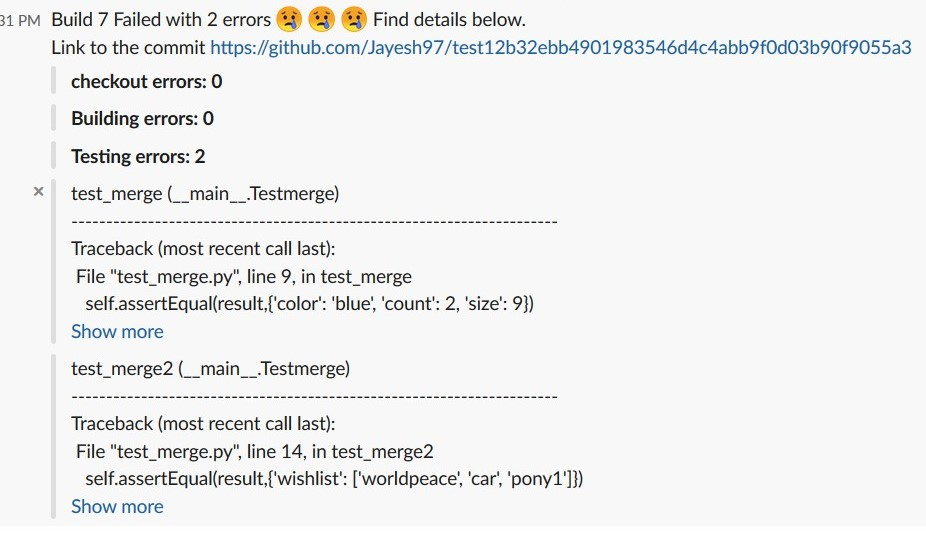

## Deployment

We have used Docker and Ansible as our configuration management tools

### Command to deploy Bot

ansible-playbook deploy.yml -i hosts

Note: credentials.json needs to be copied beforehand in 2 folders
* credentials.json(in server) - For Bot to Slack Communication
* credentials.json(in server/elasticsearch) - For Bot to elasticsearch communication

* Also, we need Public keys for Host machines to clone the Bot Repo from Github

## Screencast Video Links
* Deployment: https://drive.google.com/file/d/1oa2YkRHDmnUlstoGkPxyCnOlHKNWSgnU/view?usp=sharing
* Integration: https://drive.google.com/open?id=1NOJCQ2CZV44LFbitQw5cE2g5YAjKTmWF

## Acceptance Testing

#### Pre requisites

1. Accept invite to join the slack channel #bot
2. After you join the channel, follow the instructions to execute the commands for the use cases.

#### Command format

`/bot-assemble {action-name} {project-name} {build-number}`

action-name: `build` or `analysis`

project-name: `se_project` or `se`

build-number (optional for action `analysis`): `1` or `2` or `3`   

#### Use case 1: (Manual trigger for build status from slack)

##### [AC-1] Successful build case 

1. In slack enter the following command `/bot-assemble build se 1`
2. Expect the response from bot as 

    

##### [AC-2] Successful build case 

1. In slack enter the following command `/bot-assemble build se_project 7`
2. Expect the response from bot as 

    

#### Use case 2: (Build analysis graphs from slack)

##### [AC-3] Analysis of a particular build

1. In slack enter the following command `/bot-assemble analysis se_project 7`
2. Expect the response from bot as 
    
    

##### [AC-4] Analysis of whole project (aggregated builds)

1. In slack enter the following command `/bot-assemble analysis se_project`
2. Expect the response from bot as 
    
    

#### [AC-5] Use case 3: (Trigger from changes in the hooked Repo)

1. Clone the following repo using `git clone https://github.ncsu.edu/sjbondu/se_project.git`
2. Make changes to the repo, commit and push the changes back to the repo
2. Expect the response from bot as 
    
    

#### Invalid Commands

##### [AC-6] Invalid action

1. In slack enter the following invalid command `/bot-assemble random_command se_project`
2. Expect the output to be `Invalid action. Please use either bot-assemble analysis {project-name} {build-number} or bot-assemble vis {project-name} {build-number}`

##### [AC-7] Invalid syntax

1. In slack enter the following invalid syntax `/bot-assemble analysis`
2. Expect the output to be `Invalid Syntax. Please use bot-assemble {action} {project-name} {build-number} to get the details`

##### [AC-8] Invalid project_name or build_number

1. In slack enter the following invalid project_name/build_number `/bot-assemble analysis se_project 99999`
2. Expect the output to be `Project Name or Build number is invalid. Please check`
